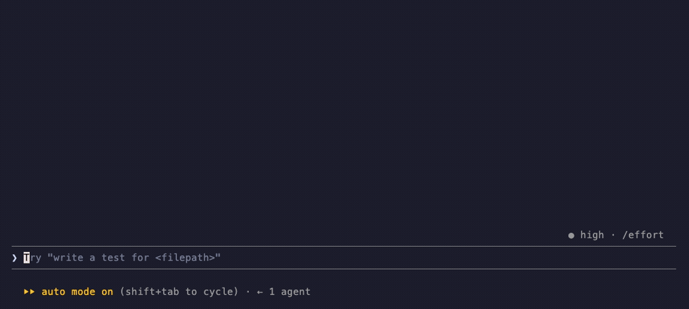

<p align="center">
  
</p>

<h1 align="center">ccfind</h1>

<p align="center">
  <b>Full-text search across your past Claude Code sessions.</b><br>
  Finds the conversation where something was actually discussed - and hands you the command to resume it.
</p>

<p align="center">
  
  
  
  
  
</p>

---

## The problem

Claude Code writes every session to disk in `~/.claude/projects/*.jsonl`. Nothing
in the CLI searches it.

`--resume` matches a session by id or name. `/insights` writes a report. `/find`
searches a web page in Chrome. None of them answers the only question you
actually have:

> *Which session was the one where we fixed the registry config?*

So you solve it again. The transcript was on disk the whole time.

## What you get

Not "here are some related conversations". The session, the turn you asked it in,
the line that mattered, and one command to be back inside that context with the
full history - not a summary of it.

**Inside Claude Code** - `/ccfind:ccfind <what you remember>`: every match in one
table, which one to open, and the `/resume` line that switches this window to it:

<p align="center">
  
</p>

**In a terminal** - `ccfind pick "<query>"`, arrows or the mouse over every hit,
Enter hands the terminal to `claude --resume`:

<p align="center">
  
</p>

<sub>Both recordings run against a synthetic history, so nothing private appears
in them. The numbers under [Measured](#measured) come from a real 90 MB corpus.</sub>

## Install

Two lines, typed inside Claude Code:

```
/plugin marketplace add epogonii/ccfind
/plugin install ccfind@ccfind
```

Or from a shell, before you start Claude Code:

```bash
claude plugin marketplace add epogonii/ccfind
claude plugin install ccfind@ccfind
```

Needs **Node 18+** on `PATH` and nothing else - no npm install, no dependencies,
no network, no API keys. Claude Code's native installer does not ship a Node
runtime, so run `node -v` first if the skill reports it cannot start. macOS and
Linux; Windows is untested.

## Using it

Inside Claude Code, ask for it by name:

```
/ccfind why did the node take so long to reboot
```

Or don't. The skill fires on its own when you say things like *"where did we
already fix this"*, *"which session was that"*, *"we did this before"*, *"search
my history"* - in English or in whatever language you write in. Either way you
get the answer in the chat, and `/resume <id>` for the session it came from - typed in that same
window, the built-in slash command switches you into it, so you
can keep reading with the whole original context, not a summary of it.

The GIF above is the same search run as a plain command; you can drive it that way
too, see [CLI](#cli).

## How it works

Every transcript is split into ~1 KB chunks, tokenised, and scored per field -
because *where* a word appears says a lot about whether it answers your question.

| Field | Weight | What it is |
| --- | :---: | --- |
| `title` | 3.5 | session name, from `/rename` or model-written |
| `prompt` | 3.0 | what **you** typed |
| `answer` | 1.5 | Claude's replies |
| `tool` | 1.0 | tool calls and their arguments |
| `thinking` | 0.7 | reasoning blocks |
| `output` | 0.5 | tool results, up to 16 KB each |
| `summary` | 0.4 | compaction summaries |

A hit in a question you asked outranks the same word in scrollback from a `grep`
that happened to print it.

**Identifiers are indexed whole and split**, so `certs.d`, `kube-vip` and
`InhibitDelayMaxSec` are all findable either way - but the compound you typed
always outranks its pieces.

**Injected context is stripped.** System reminders, hook output, slash-command
wrappers and turns Claude Code marks `isMeta` - a loaded skill's own body, the
"messages below were generated by the user" caveat, an image-cache path - are not
conversation. Indexed as prompts they rank boilerplate above real questions. That
was 145 of 969 user turns in the test corpus, and 108 phantom exchanges. What is
*not* stripped is a slash command's arguments: in `/ccfind where did we set the
gc threshold`, the words after the command are the question.

**Compaction summaries get their own field at the lowest weight.** Claude writes
them, you did not ask them, and they restate every topic of the session they
replace - indexed as prompts they let a continuation outrank the session that did
the work. Demoting them removed 46 more phantom turns.

**Scores roll up twice**: chunk → your turn → session. The best chunk dominates,
corroborating chunks add a capped bonus, and coverage of the words you typed
multiplies the result. So a long noisy session cannot out-sum a short precise one.

## Measured

Corpus: 78 transcripts, 90 MB, 657 exchanges, 20,729 chunks, 78,766 terms.
Index 3.9 MB gzipped plus a 13 MB chunk store.

Twelve queries, each a natural-language phrasing containing one distinctive
identifier. Ground truth is a literal `grep -F` for that identifier across the
corpus, so relevance is checkable rather than asserted.

|  | P@1 | P@3 | MRR | latency | identifier in results | resumable id |
| --- | :---: | :---: | :---: | :---: | :---: | :---: |
| **ccfind** | **0.92** | **0.89** | **0.96** | 133 ms | **12/12** | yes |
| claude-historian-mcp 1.0.3 | 0.00 | 0.00 | 0.00 | 9 ms | 0/12 | no |

`claude-historian-mcp` is the existing MCP server for this job, measured on the
same corpus and the same queries, and given a result limit of 8 against ccfind's
5 so the comparison is not tilted by list length.

<details>
<summary><b>Method, and everything that went wrong with it</b></summary>

Three transcripts are excluded from both engines and from the ground truth: the
session that ran the benchmark, and the two the benchmark itself produced (an
end-to-end plugin test and an MCP probe). All three contain ccfind's own answers,
so leaving them in lets an engine score by quoting the answer back. That is not
hypothetical - it is what the first run of this benchmark did, and fixing it cost
`claude-historian-mcp` a spurious 0.33 P@1.

**The table measures whether an engine answers the question asked.** It is not a
claim of beating `grep -rl`, which scores 1.00 by construction - the ground truth
*is* grep. What grep does not do is rank 78 transcripts, tell you which turn a
match belongs to, or hand back a session to resume. It also reads 90 MB per query
where ccfind reads a 3.9 MB index.

**The one miss is real.** One query - the identifier `image-gc-high` plus three
ordinary words around it - has a single correct session; ccfind returns it at
rank 2, with the exact `image-gc-high=75` snippet, behind a longer session that matched three common words but not the identifier.
BM25's idf is logarithmic, so one rare identifier and two medium-rare words come
out close, and a growing corpus tips it either way. Tuning constants until this
one query passes would be fitting the benchmark, not fixing retrieval.

**P@3 is capped by the corpus**: one query has a single correct session, so its
P@3 cannot exceed 0.33. The ceiling across the twelve is 0.94 against a measured
0.89. The gap is two queries that put an unrelated session at rank 3 - one pulls
in an Ansible session that matched only the query's one common word, *reboot*.
The score already says so: 6.43 against 22.61 for the correct top hit. Rank 3 is where a
lexical engine spends its uncertainty.

**On the incumbent.** `claude-historian-mcp` retrieves by recency, not by the
query. Called without a limit it returns the same 93 lines every time - mean
line-level overlap between different queries is 98.9%, the only reliably
differing line being the one echoing your query back, under a constant "Found 130
messages". Called with a limit of 8 it returns nothing at all for 6 of the 12
queries, and for the rest returns recent assistant messages on unrelated topics:
one query about coredns replicas came back with a draft-PR discussion, an Ansible
`sshd_config` refactor, and an EF Core `DbContext` review, each scored 2. After
removing results that are ccfind's own output quoted back, 7 of 12 return
nothing. The distinctive identifier appears in its output 0 times out of 12, and
no result carries a session id - the only ids in its payloads are `claude
--resume` lines inside quoted ccfind answers - so there is nothing to resume from
even when a hit is right. Both package names run the same code: the server
reports itself as `claude-historian` 1.0.0 either way.

**Latency.** ccfind's 133 ms is a cold `node` process: interpreter start plus
loading the 3.9 MB index. The query itself takes 0-3 ms once the index is in
memory. Indexing 90 MB from scratch takes about 2 seconds; an unchanged corpus is
detected and skipped instantly - though inside a live session your current
transcript is always growing, so a search from within Claude Code normally pays
the rebuild.

</details>

## CLI

The script runs standalone, without Claude:

```bash
node skills/ccfind/scripts/ccfind.mjs index                       # build or refresh
node skills/ccfind/scripts/ccfind.mjs index --full                # force full rebuild
node skills/ccfind/scripts/ccfind.mjs stats                       # index size and counts
node skills/ccfind/scripts/ccfind.mjs search "registry mirror" --limit 5
node skills/ccfind/scripts/ccfind.mjs show <session-id>            # one session's turns
node skills/ccfind/scripts/ccfind.mjs pick "registry mirror"      # arrow-key picker
node skills/ccfind/scripts/ccfind.mjs bench "q1" "q2"             # latency per query
```

`ccfind` is not on your PATH out of the box - the plugin ships a script, not a
binary. One command fixes that, no alias to write:

```bash
node "$CLAUDE_PLUGIN_ROOT/skills/ccfind/scripts/ccfind.mjs" install
```

It writes a small launcher into the first writable directory already on your PATH
(`~/.local/bin`, `~/bin`, `/usr/local/bin`, or `$CCFIND_BIN_DIR` - which wins if
set), tells you which one, and prints the `export PATH` line if that directory
turns out not to be on it. Nothing else on the system is touched.

The launcher looks up the installed plugin version each time it runs, so
`claude plugin update` needs nothing redone - a plain symlink would not survive
it, because Claude Code unpacks every version into its own
`~/.claude/plugins/cache/<marketplace>/ccfind/<version>/` directory. `uninstall`
removes the launcher, and refuses to touch a file it did not write.

`open <id>` launches a new terminal window on one session - `claude --resume` in
that session's own working directory. It uses your multiplexer or terminal, in
this order: a `tmux` window if `$TMUX` is set, iTerm or Terminal on macOS,
`$TERMINAL` / `x-terminal-emulator` / gnome-terminal / konsole / kitty / wezterm
/ alacritty / xterm on Linux. `CCFIND_OPEN_DRYRUN=1` prints what it would run.
If none of them work it falls back to telling you the `/resume` line.

Inside a Claude Code session, `/resume <id>` is the other half: that built-in
slash command switches the window you type it in, rather than opening a second
one.

`pick` is the one that answers "let me choose it and open it". Up and down or the
mouse wheel move; a click selects a row and a second click on the highlighted row
opens it; Enter hands the terminal to `claude --resume` for the highlighted
session; `q` quits. Mouse tracking is switched off again on exit, so the
terminal's own text selection comes back. It needs a real terminal - piped or
captured, it falls back to printing the list. Inside Claude Code the skill offers the same choice through the built-in
picker, but that can only pull the session's content into the current
conversation: nothing can switch the active session from inside it.

| Flag | Effect |
| --- | --- |
| `--limit N` | how many results |
| `--group session\|exchange` | whole session, or the single turn |
| `--project SUBSTR` | restrict by project or cwd |
| `--session ID` | search inside one session |
| `--days N` | only the last N days |
| `--field title\|prompt\|answer\|thinking\|tool\|output\|summary` | search only that field |
| `--exclude ID[,ID...]` | drop sessions from results |
| `--self` | include the current session (excluded by default) |
| `--json` | machine-readable output |
| `--turns N` | `show` only: how many turns to print (default 40) |

Worth knowing: `--field prompt` finds where **you** raised something,
`--field output` finds what a command actually printed, and `--group exchange`
pinpoints the turn instead of the session.

## Storage

```
~/.claude/ccfind/index.json.gz   postings, lengths, offsets, session metadata
~/.claude/ccfind/docs.jsonl      indexed chunks, for snippets
~/.claude/ccfind/state.json      per-transcript size and mtime
```

Delete the directory to reset. Nothing else is written, anywhere.

## Limits

- Any change to any transcript triggers a full rebuild. At ~2 s per 90 MB that is
  fine; true incremental merge lands once the on-disk format settles.
- BM25 is lexical. A query sharing no words with the conversation will not match
  it - there are no embeddings and no API calls.
- Terms appearing in more than 40% of chunks are dropped from the index.
- Snippets are verbatim transcript text, so whatever you pasted into a session - a
  password, a token, an internal hostname - can come back in a result. Nothing
  leaves the machine, but the output is as sensitive as the history it searches.

## Support

The plugin is free and stays free. If it saved you an afternoon:

<p align="center">
  <a href="https://github.com/sponsors/epogonii"></a>
  <a href="https://www.paypal.com/paypalme/pogonii"></a>
</p>

| | |
| --- | --- |
| GitHub Sponsors | **[github.com/sponsors/epogonii](https://github.com/sponsors/epogonii)**, monthly or one time |
| PayPal | **[paypal.me/pogonii](https://www.paypal.com/paypalme/pogonii)** |
| Bitcoin | `bc1qe6fjj3uv23e2yx2ry3wwhyrl7s2pqshau7mga3` |
| Ethereum | `0xDC9e1EfA0F8FAE71377F4018d4ff7D123369438e` |
| Solana | `3sYQyR27CVz1VcwCfoDLUioaAHk8jspQaSDHXEvBALxg` |

---

## Licence

MIT. See [LICENSE](LICENSE).
